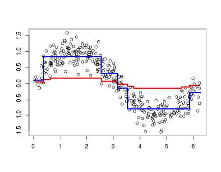

# awesome-gradient-boosting-papers

  

A curated list of gradient and adaptive boosting papers with implementations from the following conferences:

- Machine learning
   * [NeurIPS](https://nips.cc/) 
   * [ICML](https://icml.cc/) 
   * [ICLR](https://iclr.cc/)
- Computer vision
   * [CVPR](http://cvpr2019.thecvf.com/)
   * [ICCV](http://iccv2019.thecvf.com/)
   * [ECCV](https://eccv2018.org/)
- Natural language processing
   * [ACL](http://www.acl2019.org/EN/index.xhtml)
   * [NAACL](https://naacl2019.org/)
   * [EMNLP](https://www.emnlp-ijcnlp2019.org/) 
- Data Mining
   * [KDD](https://www.kdd.org/)
   * [ICDM](http://icdm2019.bigke.org/)
   * [WWW](https://www2019.thewebconf.org/)
- Artificial intelligence
   * [AAAI](https://www.aaai.org/)
   * [IJCAI](https://www.ijcai.org/)
   * [UAI](http://www.auai.org/)

A similar collection about [graph embedding](https://github.com/benedekrozemberczki/awesome-graph-embedding) and [community detection](https://github.com/benedekrozemberczki/awesome-community-detection) papers with implementations.
## 2018
- **Boosted Generative Models (AAAI 2018)**
  - Aditya Grover, Stefano Ermon
  - [[Paper]](https://arxiv.org/pdf/1702.08484.pdf)
  - [[Code]](https://github.com/ermongroup/bgm)

- **Boosting Variational Inference: an Optimization Perspective (AISTATS 2018)**
  - Francesco Locatello, Rajiv Khanna, Joydeep Ghosh, Gunnar Rätsch
  - [[Paper]](https://arxiv.org/abs/1708.01733)
  - [[Code]](https://github.com/ratschlab/boosting-bbvi)

- **Online Boosting Algorithms for Multi-label Ranking (AISTATS 2018)**
  - Young Hun Jung, Ambuj Tewari
  - [[Paper]](https://arxiv.org/abs/1710.08079)
  - [[Code]](https://github.com/yhjung88/OnlineMLRBoostingWithVFDT)

- **DualBoost: Handling Missing Values with Feature Weights and Weak Classifiers that Abstain (CIKM 2018)**
  - Weihong Wang, Jie Xu, Yang Wang, Chen Cai, Fang Chen
  - [[Paper]](http://delivery.acm.org/10.1145/3270000/3269319/p1543-wang.pdf?ip=129.215.164.203&id=3269319&acc=ACTIVE%20SERVICE&key=C2D842D97AC95F7A%2EEB9E991028F4E1F1%2E4D4702B0C3E38B35%2E4D4702B0C3E38B35&__acm__=1558633895_f01b39fd47b943fd01eade763a397e04)

- **Functional Gradient Boosting based on Residual Network Perception (ICML 2018)**
  - Atsushi Nitanda, Taiji Suzuki
  - [[Paper]](https://arxiv.org/abs/1802.09031)
  - [[Code]](https://github.com/anitan0925/ResFGB)

- **Finding Influential Training Samples for Gradient Boosted Decision Trees (ICML 2018)**
  - Boris Sharchilev, Yury Ustinovskiy, Pavel Serdyukov, Maarten de Rijke
  - [[Paper]](https://arxiv.org/abs/1802.06640)

- **Learning Deep ResNet Blocks Sequentially using Boosting Theory (ICML 2018)**
  - Furong Huang, Jordan T. Ash, John Langford, Robert E. Schapire
  - [[Paper]](https://arxiv.org/abs/1706.04964)
  - [[Code]](https://github.com/JordanAsh/boostresnet)

- **UCBoost: A Boosting Approach to Tame Complexity and Optimality for Stochastic Bandits (IJCAI 2018)**
  - Fang Liu, Sinong Wang, Swapna Buccapatnam, Ness B. Shroff
  - [[Paper]](https://www.ijcai.org/proceedings/2018/0338.pdf)
  - [[Code]](https://smpybandits.github.io/docs/Policies.UCBoost.html)

- **Adaboost with Auto-Evaluation for Conversational Models (IJCAI 2018)**
  - Juncen Li, Ping Luo, Ganbin Zhou, Fen Lin, Cheng Niu
  - [[Paper]](https://www.ijcai.org/proceedings/2018/0580.pdf)

- **Ensemble Neural Relation Extraction with Adaptive Boosting (IJCAI 2018)**
  - Dongdong Yang, Senzhang Wang, Zhoujun Li
  - [[Paper]](https://www.ijcai.org/proceedings/2018/0630.pdf)

- **CatBoost: unbiased boosting with categorical features (NIPS 2018)**
  - Liudmila Ostroumova Prokhorenkova, Gleb Gusev, Aleksandr Vorobev, Anna Veronika Dorogush, Andrey Gulin
  - [[Paper]](https://papers.nips.cc/paper/7898-catboost-unbiased-boosting-with-categorical-features.pdf)
  - [[Code]](https://github.com/catboost/catboost)

- **Multitask Boosting for Survival Analysis with Competing Risks (NIPS 2018)**
  - Alexis Bellot, Mihaela van der Schaar
  - [[Paper]](https://papers.nips.cc/paper/7413-multitask-boosting-for-survival-analysis-with-competing-risks)

- **Multi-Layered Gradient Boosting Decision Trees (NIPS 2018)**
  - Ji Feng, Yang Yu, Zhi-Hua Zhou
  - [[Paper]](https://papers.nips.cc/paper/7614-multi-layered-gradient-boosting-decision-trees.pdf)
  - [[Code]](https://github.com/kingfengji/mGBDT)

- **Boosted Sparse and Low-Rank Tensor Regression (NIPS 2018)**
  - Lifang He, Kun Chen, Wanwan Xu, Jiayu Zhou, Fei Wang
  - [[Paper]](https://arxiv.org/abs/1811.01158)
  - [[Code]](https://github.com/LifangHe/NeurIPS18_SURF)

## 2017
- **Boosting for Real-Time Multivariate Time Series Classification (AAAI 2017)**
  - Haishuai Wang, Jun Wu
  - [[Paper]]( )
  - [[Code]]( )

- **Cross-Domain Sentiment Classification via Topic-Related TrAdaBoost (AAAI 2017)**
  - Xingchang Huang, Yanghui Rao, Haoran Xie, Tak-Lam Wong, Fu Lee Wang
  - [[Paper]]( )
  - [[Code]]( )

- **Extreme Gradient Boosting and Behavioral Biometrics (AAAI 2017)**
  - Benjamin Manning
  - [[Paper]]( )
  - [[Code]]( )

- **FeaBoost: Joint Feature and Label Refinement for Semantic Segmentation (AAAI 2017)**
  - Yulei Niu, Zhiwu Lu, Songfang Huang, Xin Gao, Ji-Rong Wen
  - [[Paper]]( )
  - [[Code]]( )

- **Boosting Complementary Hash Tables for Fast Nearest Neighbor Search (AAAI 2017)**
  - Xianglong Liu, Cheng Deng, Yadong Mu, Zhujin Li
  - [[Paper]]( )
  - [[Code]]( )

- **Gradient Boosting on Stochastic Data Streams (AISTATS 2017)**
  - Hanzhang Hu, Wen Sun, Arun Venkatraman, Martial Hebert, J. Andrew Bagnell
  - [[Paper]]( )
  - [[Code]]( )

- **BoostVHT: Boosting Distributed Streaming Decision Trees (CIKM 2017)**
  - Theodore Vasiloudis, Foteini Beligianni, Gianmarco De Francisci Morales
  - [[Paper]]( )
  - [[Code]]( )

- **Integrating Side Information for Boosting Machine Comprehension (CIKM 2017)**
  - Yutong Wang, Yixin Xu, Min Yang, Zhou Zhao, Jun Xiao, Yueting Zhuang
  - [[Paper]]( )
  - [[Code]]( )

- **A Way to Boost Semi-NMF for Document Clustering (CIKM 2017)**
  - Aghiles Salah, Melissa Ailem, Mohamed Nadif
  - [[Paper]]( )
  - [[Code]]( )

- **Fast Boosting Based Detection Using Scale Invariant Multimodal Multiresolution Filtered Features (CVPR 2017)**
  - Arthur Daniel Costea, Robert Varga, Sergiu Nedevschi
  - [[Paper]]( )
  - [[Code]]( )

- **BIER - Boosting Independent Embeddings Robustly (ICCV 2017)**
  - Michael Opitz, Georg Waltner, Horst Possegger, Horst Bischof
  - [[Paper]]( )
  - [[Code]]( )

- **An Analysis of Boosted Linear Classifiers on Noisy Data with Applications to Multiple-Instance Learning (ICDM 2017)**
  - Rui Liu, Soumya Ray
  - [[Paper]]( )
  - [[Code]]( )

- **Variational Boosting: Iteratively Refining Posterior Approximations (ICML 2017)**
  - Andrew C. Miller, Nicholas J. Foti, Ryan P. Adams
  - [[Paper]]( )
  - [[Code]]( )

- **Boosted Fitted Q-Iteration (ICML 2017)**
  - Samuele Tosatto, Matteo Pirotta, Carlo D'Eramo, Marcello Restelli
  - [[Paper]]( )
  - [[Code]]( )

- **A Simple Multi-Class Boosting Framework with Theoretical Guarantees and Empirical Proficiency (ICML 2017)**
  - Ron Appel, Pietro Perona
  - [[Paper]]( )
  - [[Code]]( )

- **Gradient Boosted Decision Trees for High Dimensional Sparse Output (ICML 2017)**
  - Si Si, Huan Zhang, S. Sathiya Keerthi, Dhruv Mahajan, Inderjit S. Dhillon, Cho-Jui Hsieh
  - [[Paper]]( )
  - [[Code]]( )

- **Local Topic Discovery via Boosted Ensemble of Nonnegative Matrix Factorization (IJCAI 2017)**
  - Sangho Suh, Jaegul Choo, Joonseok Lee, Chandan K. Reddy
  - [[Paper]]( )
  - [[Code]]( )

- **Boosted Zero-Shot Learning with Semantic Correlation Regularization (IJCAI 2017)**
  - Te Pi, Xi Li, Zhongfei (Mark) Zhang
  - [[Paper]]( )
  - [[Code]]( )

- **BDT: Gradient Boosted Decision Tables for High Accuracy and Scoring Efficiency (KDD 2017)**
  - Yin Lou, Mikhail Obukhov
  - [[Paper]]( )
  - [[Code]]( )

- **Cost efficient gradient boosting (NIPS 2017)**
  - Sven Peter, Ferran Diego, Fred A. Hamprecht, Boaz Nadler
  - [[Paper]]( )
  - [[Code]]( )

- **AdaGAN: Boosting Generative Models (NIPS 2017)**
  - Ilya O. Tolstikhin, Sylvain Gelly, Olivier Bousquet, Carl-Johann Simon-Gabriel, Bernhard Schölkopf
  - [[Paper]]( )
  - [[Code]]( )

- **LightGBM: A Highly Efficient Gradient Boosting Decision Tree (NIPS 2017)**
  - Guolin Ke, Qi Meng, Thomas Finley, Taifeng Wang, Wei Chen, Weidong Ma, Qiwei Ye, Tie-Yan Liu
  - [[Paper]]( )
  - [[Code]]( )

- **Early stopping for kernel boosting algorithms: A general analysis with localized complexities (NIPS 2017)**
  - Yuting Wei, Fanny Yang, Martin J. Wainwright
  - [[Paper]]( )
  - [[Code]]( )

- **Online multiclass boosting (NIPS 2017)**
  - Young Hun Jung, Jack Goetz, Ambuj Tewari
  - [[Paper]]( )
  - [[Code]]( )

- **GB-CENT: Gradient Boosted Categorical Embedding and Numerical Trees (WWW 2017)**
  - Qian Zhao, Yue Shi, Liangjie Hong
  - [[Paper]]( )
  - [[Code]]( )

## 2016
- **Group Cost-Sensitive Boosting for Multi-Resolution Pedestrian Detection (AAAI 2016)**
  - Chao Zhu, Yuxin Peng
  - [[Paper]]( )
  - [[Code]]( )

- **Communication Efficient Distributed Agnostic Boosting (AISTATS 2016)**
  - Shang-Tse Chen, Maria-Florina Balcan, Duen Horng Chau
  - [[Paper]]( )
  - [[Code]]( )

- **Logistic Boosting Regression for Label Distribution Learning (CVPR 2016)**
  - Chao Xing, Xin Geng, Hui Xue
  - [[Paper]]( )
  - [[Code]]( )

- **Structured Regression Gradient Boosting (CVPR 2016)**
  - Ferran Diego, Fred A. Hamprecht
  - [[Paper]]( )
  - [[Code]]( )

- **L-EnsNMF: Boosted Local Topic Discovery via Ensemble of Nonnegative Matrix Factorization (ICDM 2016)**
  - Sangho Suh, Jaegul Choo, Joonseok Lee, Chandan K. Reddy
  - [[Paper]]( )
  - [[Code]]( )

- **Meta-Gradient Boosted Decision Tree Model for Weight and Target Learning (ICML 2016)**
  - Yury Ustinovskiy, Valentina Fedorova, Gleb Gusev, Pavel Serdyukov
  - [[Paper]]( )
  - [[Code]]( )

- **Generalized Dictionary for Multitask Learning with Boosting (IJCAI 2016)**
  - Boyu Wang, Joelle Pineau
  - [[Paper]]( )
  - [[Code]]( )

- **Self-Paced Boost Learning for Classification (IJCAI 2016)**
  - Te Pi, Xi Li, Zhongfei Zhang, Deyu Meng, Fei Wu, Jun Xiao, Yueting Zhuang
  - [[Paper]]( )
  - [[Code]]( )

- **Interactive Martingale Boosting (IJCAI 2016)**
  - Ashish Kulkarni, Pushpak Burange, Ganesh Ramakrishnan
  - [[Paper]]( )
  - [[Code]]( )

- **Optimal and Adaptive Algorithms for Online Boosting (IJCAI 2016)**
  - Alina Beygelzimer, Satyen Kale, Haipeng Luo
  - [[Paper]]( )
  - [[Code]]( )

- **Rating-Boosted Latent Topics: Understanding Users and Items with Ratings and Reviews (IJCAI 2016)**
  - Yunzhi Tan, Min Zhang, Yiqun Liu, Shaoping Ma
  - [[Paper]]( )
  - [[Code]]( )

- **XGBoost: A Scalable Tree Boosting System (KDD 2016)**
  - Tianqi Chen, Carlos Guestrin
  - [[Paper]]( )
  - [[Code]]( )

- **Boosted Decision Tree Regression Adjustment for Variance Reduction in Online Controlled Experiments (KDD 2016)**
  - Alexey Poyarkov, Alexey Drutsa, Andrey Khalyavin, Gleb Gusev, Pavel Serdyukov
  - [[Paper]]( )
  - [[Code]]( )

- **Boosting with Abstention (NIPS 2016)**
  - Corinna Cortes, Giulia DeSalvo, Mehryar Mohri
  - [[Paper]]( )
  - [[Code]]( )

- **SEBOOST - Boosting Stochastic Learning Using Subspace Optimization Techniques (NIPS 2016)**
  - Elad Richardson, Rom Herskovitz, Boris Ginsburg, Michael Zibulevsky
  - [[Paper]]( )
  - [[Code]]( )

- **Incremental Boosting Convolutional Neural Network for Facial Action Unit Recognition (NIPS 2016)**
  - Shizhong Han, Zibo Meng, Ahmed-Shehab Khan, Yan Tong
  - [[Paper]]( )
  - [[Code]]( )

## 2015

- **Online Boosting Algorithms for Anytime Transfer and Multitask Learning (AAAI 2015)**
  - Boyu Wang, Joelle Pineau
  - [[Paper]]( )
  - [[Code]]( )

- **A Boosted Multi-Task Model for Pedestrian Detection with Occlusion Handling (AAAI 2015)**
  - Chao Zhu, Yuxin Peng
  - [[Paper]]( )
  - [[Code]]( )

- **Efficient Second-Order Gradient Boosting for Conditional Random Fields (AISTATS 2015)**
  - Tianqi Chen, Sameer Singh, Ben Taskar, Carlos Guestrin
  - [[Paper]]( )
  - [[Code]]( )

- **Tumblr Blog Recommendation with Boosted Inductive Matrix Completion (CIKM 2015)**
  - Donghyuk Shin, Suleyman Cetintas, Kuang-Chih Lee, Inderjit S. Dhillon
  - [[Paper]]( )
  - [[Code]]( )

- **Basis mapping based boosting for object detection (CVPR 2015)**
  - Haoyu Ren, Ze-Nian Li
  - [[Paper]]( )
  - [[Code]]( )

- **Tracking-by-Segmentation with Online Gradient Boosting Decision Tree (ICCV 2015)**
  - Jeany Son, Ilchae Jung, Kayoung Park, Bohyung Han
  - [[Paper]]( )
  - [[Code]]( )

- **Learning to Boost Filamentary Structure Segmentation (ICCV 2015)**
  - Lin Gu, Li Cheng
  - [[Paper]]( )
  - [[Code]]( )

- **Optimal and Adaptive Algorithms for Online Boosting (ICML 2015)**
  - Alina Beygelzimer, Satyen Kale, Haipeng Luo
  - [[Paper]]( )
  - [[Code]]( )

- **Rademacher Observations, Private Data, and Boosting (ICML 2015)**
  - Richard Nock, Giorgio Patrini, Arik Friedman
  - [[Paper]]( )
  - [[Code]]( )

- **Boosted Categorical Restricted Boltzmann Machine for Computational Prediction of Splice Junctions (ICML 2015)**
  - Taehoon Lee, Sungroh Yoon
  - [[Paper]]( )
  - [[Code]]( )

- **A Direct Boosting Approach for Semi-supervised Classification (IJCAI 2015)**
  - Shaodan Zhai, Tian Xia, Zhongliang Li, Shaojun Wang
  - [[Paper]]( )
  - [[Code]]( )

- **A Boosting Algorithm for Item Recommendation with Implicit Feedback (IJCAI 2015)**
  - Yong Liu, Peilin Zhao, Aixin Sun, Chunyan Miao
  - [[Paper]]( )
  - [[Code]]( )

- **Training-Time Optimization of a Budgeted Booster (IJCAI 2015)**
  - Yi Huang, Brian Powers, Lev Reyzin
  - [[Paper]]( )
  - [[Code]]( )

- **Optimal Action Extraction for Random Forests and Boosted Trees (KDD 2015)**
  - Zhicheng Cui, Wenlin Chen, Yujie He, Yixin Chen
  - [[Paper]]( )
  - [[Code]]( )

- **Online Gradient Boosting (NIPS 2015)**
  - Alina Beygelzimer, Elad Hazan, Satyen Kale, Haipeng Luo
  - [[Paper]]( )
  - [[Code]]( )

## 2014
- **On Boosting Sparse Parities (AAAI 2014)**
  - Lev Reyzin
  - [[Paper]]( )
  - [[Code]]( )

- **Boosting SBDS for Partial Symmetry Breaking in Constraint Programming (AAAI 2014)**
  - Jimmy H. M. Lee, Zichen Zhu
  - [[Paper]]( )
  - [[Code]]( )

- **Joint Coupled-Feature Representation and Coupled Boosting for AD Diagnosis (CVPR 2014)**
  - Yinghuan Shi, Heung-Il Suk, Yang Gao, Dinggang Shen
  - [[Paper]]( )
  - [[Code]]( )

- **From Categories to Individuals in Real Time - A Unified Boosting Approach (CVPR 2014)**
  - David Hall, Pietro Perona
  - [[Paper]]( )
  - [[Code]]( )

- **Efficient Boosted Exemplar-Based Face Detection (CVPR 2014)**
  - Haoxiang Li, Zhe Lin, Jonathan Brandt, Xiaohui Shen, Gang Hua
  - [[Paper]]( )
  - [[Code]]( )

- **Facial Expression Recognition via a Boosted Deep Belief Network (CVPR 2014)**
  - Ping Liu, Shizhong Han, Zibo Meng, Yan Tong
  - [[Paper]]( )
  - [[Code]]( )

- **Confidence-Rated Multiple Instance Boosting for Object Detection (CVPR 2014)**
  - Karim Ali, Kate Saenko
  - [[Paper]]( )
  - [[Code]]( )

- **The return of AdaBoost.MH: multi-class Hamming trees (ICLR 2014)**
  - Balázs Kégl
  - [[Paper]]( )
  - [[Code]]( )

- **Deep Boosting (ICML 2014)**
  - Corinna Cortes, Mehryar Mohri, Umar Syed
  - [[Paper]]( )
  - [[Code]]( )

- **A Convergence Rate Analysis for LogitBoost%2C MART and Their Variant (ICML 2014)**
  - Peng Sun, Tong Zhang, Jie Zhou
  - [[Paper]]( )
  - [[Code]]( )

- **Boosting with Online Binary Learners for the Multiclass Bandit Problem (ICML 2014)**
  - Shang-Tse Chen, Hsuan-Tien Lin, Chi-Jen Lu
  - [[Paper]]( )
  - [[Code]]( )

- **Boosting multi-step autoregressive forecasts (ICML 2014)**
  - Souhaib Ben Taieb, Rob J. Hyndman
  - [[Paper]]( )
  - [[Code]]( )

- **Dynamic Programming Boosting for Discriminative Macro-Action Discovery (ICML 2014)**
  - Leonidas Lefakis, François Fleuret
  - [[Paper]]( )
  - [[Code]]( )

- **Guess-Averse Loss Functions For Cost-Sensitive Multiclass Boosting (ICML 2014)**
  - Oscar Beijbom, Mohammad J. Saberian, David J. Kriegman, Nuno Vasconcelos
  - [[Paper]]( )
  - [[Code]]( )

- **A multi-class boosting method with direct optimization (KDD 2014)**
  - Shaodan Zhai, Tian Xia, Shaojun Wang
  - [[Paper]]( )
  - [[Code]]( )

- **Gradient boosted feature selection (KDD 2014)**
  - Zhixiang Eddie Xu, Gao Huang, Kilian Q. Weinberger, Alice X. Zheng
  - [[Paper]]( )
  - [[Code]]( )

- **Multi-Class Deep Boosting (NIPS 2014)**
  - Vitaly Kuznetsov, Mehryar Mohri, Umar Syed
  - [[Paper]]( )
  - [[Code]]( )

- **Deconvolution of High Dimensional Mixtures via Boosting%2C with Application to Diffusion-Weighted MRI of Human Brain (NIPS 2014)**
  - Charles Y. Zheng, Franco Pestilli, Ariel Rokem
  - [[Paper]]( )
  - [[Code]]( )

- **A Drifting-Games Analysis for Online Learning and Applications to Boosting (NIPS 2014)**
  - Haipeng Luo, Robert E. Schapire
  - [[Paper]]( )
  - [[Code]]( )

- **A Boosting Framework on Grounds of Online Learning (NIPS 2014)**
  - Tofigh Naghibi Mohamadpoor, Beat Pfister
  - [[Paper]]( )
  - [[Code]]( )

## 2013
- **Entity-centric document filtering: boosting feature mapping through meta-features (CIKM 2013)**
  - Mianwei Zhou, Kevin Chen-Chuan Chang
  - [[Paper]]( )
  - [[Code]]( )

- **Boosting Binary Keypoint Descriptors (CVPR 2013)**
  - Tomasz Trzcinski, C. Mario Christoudias, Pascal Fua, Vincent Lepetit
  - [[Paper]]( )
  - [[Code]]( )

- **Boosting Cross-Language Retrieval by Learning Bilingual Phrase Associations from Relevance Rankings (EMNLP 2013)**
  - Artem Sokolov, Laura Jehl, Felix Hieber, Stefan Riezler
  - [[Paper]]( )
  - [[Code]]( )

- **PerturBoost: Practical Confidential Classifier Learning in the Cloud (ICDM 2013)**
  - Keke Chen, Shumin Guo
  - [[Paper]]( )
  - [[Code]]( )

- **Multiclass Semi-Supervised Boosting Using Similarity Learning (ICDM 2013)**
  - Jafar Tanha, Mohammad Javad Saberian, Maarten van Someren
  - [[Paper]]( )
  - [[Code]]( )

- **Saving Evaluation Time for the Decision Function in Boosting: Representation and Reordering Base Learner (ICML 2013)**
  - Peng Sun, Jie Zhou
  - [[Paper]]( )
  - [[Code]]( )

- **General Functional Matrix Factorization Using Gradient Boosting (ICML 2013)**
  - Tianqi Chen, Hang Li, Qiang Yang, Yong Yu
  - [[Paper]]( )
  - [[Code]]( )

- **Margins%2C Shrinkage%2C and Boosting (ICML 2013)**
  - Matus Telgarsky
  - [[Paper]]( )
  - [[Code]]( )

- **Quickly Boosting Decision Trees - Pruning Underachieving Features Early (ICML 2013)**
  - Ron Appel, Thomas J. Fuchs, Piotr Dollár, Pietro Perona
  - [[Paper]]( )
  - [[Code]]( )

- **Human Boosting (ICML 2013)**
  - Harsh H. Pareek, Pradeep Ravikumar
  - [[Paper]]( )
  - [[Code]]( )

- **Boosting Cross-Lingual Knowledge Linking via Concept Annotation (IJCAI 2013)**
  - Zhichun Wang, Juanzi Li, Jie Tang
  - [[Paper]]( )
  - [[Code]]( )

- **Collaborative boosting for activity classification in microblogs (KDD 2013)**
  - Yangqiu Song, Zhengdong Lu, Cane Wing-ki Leung, Qiang Yang
  - [[Paper]]( )
  - [[Code]]( )

- **Direct 0-1 Loss Minimization and Margin Maximization with Boosting (NIPS 2013)**
  - Shaodan Zhai, Tian Xia, Ming Tan, Shaojun Wang
  - [[Paper]]( )
  - [[Code]]( )

- **Reservoir Boosting : Between Online and Offline Ensemble Learning (NIPS 2013)**
  - Leonidas Lefakis, François Fleuret
  - [[Paper]]( )
  - [[Code]]( )

- **Non-Linear Domain Adaptation with Boosting (NIPS 2013)**
  - Carlos J. Becker, C. Mario Christoudias, Pascal Fua
  - [[Paper]]( )
  - [[Code]]( )

- **SparsityBoost: A New Scoring Function for Learning Bayesian Network Structure (UAI 2013)**
  - Eliot Brenner, David Sontag
  - [[Paper]]( )
  - [[Code]]( )

- **Boosting in the presence of label noise (UAI 2013)**
  - Jakramate Bootkrajang, Ata Kabán
  - [[Paper]]( )
  - [[Code]]( )

## 2012
- **Contextual boost for pedestrian detection (CVPR 2012)**
  - Yuanyuan Ding, Jing Xiao
  - [[Paper]]( )
  - [[Code]]( )

- **Shrink boost for selecting multi-LBP histogram features in object detection (CVPR 2012)**
  - Cher Keng Heng, Sumio Yokomitsu, Yuichi Matsumoto, Hajime Tamura
  - [[Paper]]( )
  - [[Code]]( )

- **Boosting bottom-up and top-down visual features for saliency estimation (CVPR 2012)**
  - Ali Borji
  - [[Paper]]( )
  - [[Code]]( )

- **Boosting algorithms for simultaneous feature extraction and selection (CVPR 2012)**
  - Mohammad J. Saberian, Nuno Vasconcelos
  - [[Paper]]( )
  - [[Code]]( )

- **Sharing features in multi-class boosting via group sparsity (CVPR 2012)**
  - Sakrapee Paisitkriangkrai, Chunhua Shen, Anton van den Hengel
  - [[Paper]]( )
  - [[Code]]( )

- **Feature Weighting and Selection Using Hypothesis Margin of Boosting (ICDM 2012)**
  - Malak Alshawabkeh, Javed A. Aslam, Jennifer G. Dy, David R. Kaeli
  - [[Paper]]( )
  - [[Code]]( )

- **An AdaBoost Algorithm for Multiclass Semi-supervised Learning (ICDM 2012)**
  - Jafar Tanha, Maarten van Someren, Hamideh Afsarmanesh
  - [[Paper]]( )
  - [[Code]]( )

- **AOSO-LogitBoost: Adaptive One-Vs-One LogitBoost for Multi-Class Problem (ICML 2012)**
  - Peng Sun, Mark D. Reid, Jie Zhou
  - [[Paper]]( )
  - [[Code]]( )

- **An Online Boosting Algorithm with Theoretical Justifications (ICML 2012)**
  - Shang-Tse Chen, Hsuan-Tien Lin, Chi-Jen Lu
  - [[Paper]]( )
  - [[Code]]( )

- **Learning Image Descriptors with the Boosting-Trick (NIPS 2012)**
  - Tomasz Trzcinski, C. Mario Christoudias, Vincent Lepetit, Pascal Fua
  - [[Paper]]( )
  - [[Code]]( )

- **Accelerated Training for Matrix-norm Regularization: A Boosting Approach (NIPS 2012)**
  - Xinhua Zhang, Yaoliang Yu, Dale Schuurmans
  - [[Paper]]( )
  - [[Code]]( )

- **Bandit Algorithms boost Brain Computer Interfaces for motor-task selection of a brain-controlled button (NIPS 2012)**
  - Joan Fruitet, Alexandra Carpentier, Rémi Munos, Maureen Clerc
  - [[Paper]]( )
  - [[Code]]( )

- **Recommendations to boost content spread in social networks (WWW 2012)**
  - Vineet Chaoji, Sayan Ranu, Rajeev Rastogi, Rushi Bhatt
  - [[Paper]]( )
  - [[Code]]( )

## 2011
- **Selective Transfer Between Learning Tasks Using Task-Based Boosting (AAAI 2011)**
  - Eric Eaton, Marie desJardins
  - [[Paper]]( )
  - [[Code]]( )

- **Incorporating Boosted Regression Trees into Ecological Latent Variable Models (AAAI 2011)**
  - Rebecca A. Hutchinson, Li-Ping Liu, Thomas G. Dietterich
  - [[Paper]]( )
  - [[Code]]( )

- **FlowBoost - Appearance learning from sparsely annotated video (CVPR 2011)**
  - Karim Ali, David Hasler, François Fleuret
  - [[Paper]]( )
  - [[Code]]( )

- **AdaBoost on low-rank PSD matrices for metric learning (CVPR 2011)**
  - Jinbo Bi, Dijia Wu, Le Lu, Meizhu Liu, Yimo Tao, Matthias Wolf
  - [[Paper]]( )
  - [[Code]]( )

- **Boosted local structured HOG-LBP for object localization (CVPR 2011)**
  - Junge Zhang, Kaiqi Huang, Yinan Yu, Tieniu Tan
  - [[Paper]]( )
  - [[Code]]( )

- **A direct formulation for totally-corrective multi-class boosting (CVPR 2011)**
  - Chunhua Shen, Zhihui Hao
  - [[Paper]]( )
  - [[Code]]( )

- **Gated classifiers: Boosting under high intra-class variation (CVPR 2011)**
  - Oscar M. Danielsson, Babak Rasolzadeh, Stefan Carlsson
  - [[Paper]]( )
  - [[Code]]( )

- **TaylorBoost: First and second-order boosting algorithms with explicit margin control (CVPR 2011)**
  - Mohammad J. Saberian, Hamed Masnadi-Shirazi, Nuno Vasconcelos
  - [[Paper]]( )
  - [[Code]]( )

- **Robust and efficient regularized boosting using total Bregman divergence (CVPR 2011)**
  - Meizhu Liu, Baba C. Vemuri
  - [[Paper]]( )
  - [[Code]]( )

- **Treat samples differently: Object tracking with semi-supervised online CovBoost (ICCV 2011)**
  - Guorong Li, Lei Qin, Qingming Huang, Junbiao Pang, Shuqiang Jiang
  - [[Paper]]( )
  - [[Code]]( )

- **LinkBoost: A Novel Cost-Sensitive Boosting Framework for Community-Level Network Link Prediction (ICDM 2011)**
  - Prakash Mandayam Comar, Pang-Ning Tan, Anil K. Jain
  - [[Paper]]( )
  - [[Code]]( )

- **Learning Markov Logic Networks via Functional Gradient Boosting (ICDM 2011)**
  - Tushar Khot, Sriraam Natarajan, Kristian Kersting, Jude W. Shavlik
  - [[Paper]]( )
  - [[Code]]( )

- **Boosting on a Budget: Sampling for Feature-Efficient Prediction (ICML 2011)**
  - Lev Reyzin
  - [[Paper]]( )
  - [[Code]]( )

- **Multiclass Boosting with Hinge Loss based on Output Coding (ICML 2011)**
  - Tianshi Gao, Daphne Koller
  - [[Paper]]( )
  - [[Code]]( )

- **Generalized Boosting Algorithms for Convex Optimization (ICML 2011)**
  - Alexander Grubb, Drew Bagnell
  - [[Paper]]( )
  - [[Code]]( )

- **Imitation Learning in Relational Domains: A Functional-Gradient Boosting Approach (IJCAI 2011)**
  - Sriraam Natarajan, Saket Joshi, Prasad Tadepalli, Kristian Kersting, Jude W. Shavlik
  - [[Paper]]( )
  - [[Code]]( )

- **Boosting with Maximum Adaptive Sampling (NIPS 2011)**
  - Charles Dubout, François Fleuret
  - [[Paper]]( )
  - [[Code]]( )

- **The Fast Convergence of Boosting (NIPS 2011)**
  - Matus Telgarsky
  - [[Paper]]( )
  - [[Code]]( )

- **ShareBoost: Efficient multiclass learning with feature sharing (NIPS 2011)**
  - Shai Shalev-Shwartz, Yonatan Wexler, Amnon Shashua
  - [[Paper]]( )
  - [[Code]]( )

- **Multiclass Boosting: Theory and Algorithms (NIPS 2011)**
  - Mohammad J. Saberian, Nuno Vasconcelos
  - [[Paper]]( )
  - [[Code]]( )

- **Variance Penalizing AdaBoost (NIPS 2011)**
  - Pannagadatta K. Shivaswamy, Tony Jebara
  - [[Paper]]( )
  - [[Code]]( )

- **Boosting as a Product of Experts (UAI 2011)**
  - Narayanan Unny Edakunni, Gary Brown, Tim Kovacs
  - [[Paper]]( )
  - [[Code]]( )

- **Parallel boosted regression trees for web search ranking (WWW 2011)**
  - Stephen Tyree, Kilian Q. Weinberger, Kunal Agrawal, Jennifer Paykin
  - [[Paper]]( )
  - [[Code]]( )

## 2010
- **The Boosting Effect of Exploratory Behaviors (AAAI 2010)**
  - Jivko Sinapov, Alexander Stoytchev
  - [[Paper]]( )
  - [[Code]]( )

- **Boosting-Based System Combination for Machine Translation (ACL 2010)**
  - Tong Xiao, Jingbo Zhu, Muhua Zhu, Huizhen Wang
  - [[Paper]]( )
  - [[Code]]( )

- **Boosting social network connectivity with link revival (CIKM 2010)**
  - Yuan Tian, Qi He, Qiankun Zhao, Xingjie Liu, Wang-Chien Lee
  - [[Paper]]( )
  - [[Code]]( )

- **BagBoo: a scalable hybrid bagging-the-boosting model (CIKM 2010)**
  - Dmitry Yurievich Pavlov, Alexey Gorodilov, Cliff A. Brunk
  - [[Paper]]( )
  - [[Code]]( )

- **Automatic detection of craters in planetary images: an embedded framework using feature selection and boosting (CIKM 2010)**
  - Wei Ding, Tomasz F. Stepinski, Lourenço P. C. Bandeira, Ricardo Vilalta, Youxi Wu, Zhenyu Lu, Tianyu Cao
  - [[Paper]]( )
  - [[Code]]( )

- **Facial point detection using boosted regression and graph models (CVPR 2010)**
  - Michel François Valstar, Brais Martínez, Xavier Binefa, Maja Pantic
  - [[Paper]]( )
  - [[Code]]( )

- **Boosting for transfer learning with multiple sources (CVPR 2010)**
  - Yi Yao, Gianfranco Doretto
  - [[Paper]]( )
  - [[Code]]( )

- **Efficient rotation invariant object detection using boosted Random Ferns (CVPR 2010)**
  - Michael Villamizar, Francesc Moreno-Noguer, Juan Andrade-Cetto, Alberto Sanfeliu
  - [[Paper]]( )
  - [[Code]]( )

- **Implicit hierarchical boosting for multi-view object detection (CVPR 2010)**
  - Xavier Perrotton, Marc Sturzel, Michel Roux
  - [[Paper]]( )
  - [[Code]]( )

- **On-line semi-supervised multiple-instance boosting (CVPR 2010)**
  - Bernhard Zeisl, Christian Leistner, Amir Saffari, Horst Bischof
  - [[Paper]]( )
  - [[Code]]( )

- **Online multi-class LPBoost (CVPR 2010)**
  - Amir Saffari, Martin Godec, Thomas Pock, Christian Leistner, Horst Bischof
  - [[Paper]]( )
  - [[Code]]( )

- **Homotopy Regularization for Boosting (ICDM 2010)**
  - Zheng Wang, Yangqiu Song, Changshui Zhang
  - [[Paper]]( )
  - [[Code]]( )

- **Exploiting Local Data Uncertainty to Boost Global Outlier Detection (ICDM 2010)**
  - Bo Liu, Jie Yin, Yanshan Xiao, Longbing Cao, Philip S. Yu
  - [[Paper]]( )
  - [[Code]]( )

- **Boosting Classifiers with Tightened L0-Relaxation Penalties (ICML 2010)**
  - Noam Goldberg, Jonathan Eckstein
  - [[Paper]]( )
  - [[Code]]( )

- **Boosting for Regression Transfer (ICML 2010)**
  - David Pardoe, Peter Stone
  - [[Paper]]( )
  - [[Code]]( )

- **Boosted Backpropagation Learning for Training Deep Modular Networks (ICML 2010)**
  - Alexander Grubb, J. Andrew Bagnell
  - [[Paper]]( )
  - [[Code]]( )

- **Fast boosting using adversarial bandits (ICML 2010)**
  - Róbert Busa-Fekete, Balázs Kégl
  - [[Paper]]( )
  - [[Code]]( )

- **Boosting with structure information in the functional space: an application to graph classification (KDD 2010)**
  - Hongliang Fei, Jun Huan
  - [[Paper]]( )
  - [[Code]]( )

- **Multi-task learning for boosting with application to web search ranking (KDD 2010)**
  - Olivier Chapelle, Pannagadatta K. Shivaswamy, Srinivas Vadrevu, Kilian Q. Weinberger, Ya Zhang, Belle L. Tseng
  - [[Paper]]( )
  - [[Code]]( )

- **A Theory of Multiclass Boosting (NIPS 2010)**
  - Indraneel Mukherjee, Robert E. Schapire
  - [[Paper]]( )
  - [[Code]]( )

- **Boosting Classifier Cascades (NIPS 2010)**
  - Mohammad J. Saberian, Nuno Vasconcelos
  - [[Paper]]( )
  - [[Code]]( )

- **Joint Cascade Optimization Using A Product Of Boosted Classifiers (NIPS 2010)**
  - Leonidas Lefakis, François Fleuret
  - [[Paper]]( )
  - [[Code]]( )

- **Robust LogitBoost and Adaptive Base Class %28ABC%29 LogitBoost (UAI 2010)**
  - Ping Li
  - [[Paper]]( )
  - [[Code]]( )

## 2009
- **Using opinion-based features to boost sentence retrieval (CIKM 2009)**
  - Ronald T. Fernández, David E. Losada
  - [[Paper]]( )
  - [[Code]]( )

- **Exploiting term relationship to boost text classification (CIKM 2009)**
  - Dou Shen, Jianmin Wu, Bin Cao, Jian-Tao Sun, Qiang Yang, Zheng Chen, Ying Li
  - [[Paper]]( )
  - [[Code]]( )

- **Feature selection for ranking using boosted trees (CIKM 2009)**
  - Feng Pan, Tim Converse, David Ahn, Franco Salvetti, Gianluca Donato
  - [[Paper]]( )
  - [[Code]]( )

- **Boosting KNN text classification accuracy by using supervised term weighting schemes (CIKM 2009)**
  - Iyad Batal, Milos Hauskrecht
  - [[Paper]]( )
  - [[Code]]( )

- **Stochastic gradient boosted distributed decision trees (CIKM 2009)**
  - Jerry Ye, Jyh-Herng Chow, Jiang Chen, Zhaohui Zheng
  - [[Paper]]( )
  - [[Code]]( )

- **A general magnitude-preserving boosting algorithm for search ranking (CIKM 2009)**
  - Chenguang Zhu, Weizhu Chen, Zeyuan Allen Zhu, Gang Wang, Dong Wang, Zheng Chen
  - [[Paper]]( )
  - [[Code]]( )

- **Reducing JointBoost-based multiclass classification to proximity search (CVPR 2009)**
  - Alexandra Stefan, Vassilis Athitsos, Quan Yuan, Stan Sclaroff
  - [[Paper]]( )
  - [[Code]]( )

- **Imbalanced RankBoost for efficiently ranking large-scale image%2Fvideo collections (CVPR 2009)**
  - Michele Merler, Rong Yan, John R. Smith
  - [[Paper]]( )
  - [[Code]]( )

- **Regularized multi-class semi-supervised boosting (CVPR 2009)**
  - Amir Saffari, Christian Leistner, Horst Bischof
  - [[Paper]]( )
  - [[Code]]( )

- **Learning to associate: HybridBoosted multi-target tracker for crowded scene (CVPR 2009)**
  - Yuan Li, Chang Huang, Ram Nevatia
  - [[Paper]]( )
  - [[Code]]( )

- **Boosted multi-task learning for face verification with applications to web image and video search (CVPR 2009)**
  - Xiaogang Wang, Cha Zhang, Zhengyou Zhang
  - [[Paper]]( )
  - [[Code]]( )

- **LidarBoost: Depth superresolution for ToF 3D shape scanning (CVPR 2009)**
  - Sebastian Schuon, Christian Theobalt, James E. Davis, Sebastian Thrun
  - [[Paper]]( )
  - [[Code]]( )

- **Model Adaptation via Model Interpolation and Boosting for Web Search Ranking (EMNLP 2009)**
  - Jianfeng Gao, Qiang Wu, Chris Burges, Krysta Marie Svore, Yi Su, Nazan Khan, Shalin Shah, Hongyan Zhou
  - [[Paper]]( )
  - [[Code]]( )

- **Finding shareable informative patterns and optimal coding matrix for multiclass boosting (ICCV 2009)**
  - Bang Zhang, Getian Ye, Yang Wang, Jie Xu, Gunawan Herman
  - [[Paper]]( )
  - [[Code]]( )

- **RankBoost with l1 regularization for facial expression recognition and intensity estimation (ICCV 2009)**
  - Peng Yang, Qingshan Liu, Dimitris N. Metaxas
  - [[Paper]]( )
  - [[Code]]( )

- **A robust boosting tracker with minimum error bound in a co-training framework (ICCV 2009)**
  - Rong Liu, Jian Cheng, Hanqing Lu
  - [[Paper]]( )
  - [[Code]]( )

- **Tutorial summary: Survey of boosting from an optimization perspective (ICML 2009)**
  - Manfred K. Warmuth, S. V. N. Vishwanathan
  - [[Paper]]( )
  - [[Code]]( )

- **Boosting products of base classifiers (ICML 2009)**
  - Balázs Kégl, Róbert Busa-Fekete
  - [[Paper]]( )
  - [[Code]]( )

- **Invited talk: Drifting games%2C boosting and online learning (ICML 2009)**
  - Yoav Freund
  - [[Paper]]( )
  - [[Code]]( )

- **ABC-boost: adaptive base class boost for multi-class classification (ICML 2009)**
  - Ping Li
  - [[Paper]]( )
  - [[Code]]( )

- **Boosting with structural sparsity (ICML 2009)**
  - John C. Duchi, Yoram Singer
  - [[Paper]]( )
  - [[Code]]( )

- **Boosting Constrained Mutual Subspace Method for Robust Image-Set Based Object Recognition (IJCAI 2009)**
  - Xi Li, Kazuhiro Fukui, Nanning Zheng
  - [[Paper]]( )
  - [[Code]]( )

- **Information theoretic regularization for semi-supervised boosting (KDD 2009)**
  - Lei Zheng, Shaojun Wang, Yan Liu, Chi-Hoon Lee
  - [[Paper]]( )
  - [[Code]]( )

- **Potential-Based Agnostic Boosting (NIPS 2009)**
  - Adam Kalai, Varun Kanade
  - [[Paper]]( )
  - [[Code]]( )

- **Positive Semidefinite Metric Learning with Boosting (NIPS 2009)**
  - Chunhua Shen, Junae Kim, Lei Wang, Anton van den Hengel
  - [[Paper]]( )
  - [[Code]]( )

- **Boosting with Spatial Regularization (NIPS 2009)**
  - Zhen James Xiang, Yongxin Taylor Xi, Uri Hasson, Peter J. Ramadge
  - [[Paper]]( )
  - [[Code]]( )

## 2008
- **Group-based learning: a boosting approach (CIKM 2008)**
  - Weijian Ni, Jun Xu, Hang Li, Yalou Huang
  - [[Paper]]( )
  - [[Code]]( )

- **Boosting social annotations using propagation (CIKM 2008)**
  - Shenghua Bao, Bohai Yang, Ben Fei, Shengliang Xu, Zhong Su, Yong Yu
  - [[Paper]]( )
  - [[Code]]( )

- **Semi-supervised boosting using visual similarity learning (CVPR 2008)**
  - Christian Leistner, Helmut Grabner, Horst Bischof
  - [[Paper]]( )
  - [[Code]]( )

- **Mining compositional features for boosting (CVPR 2008)**
  - Junsong Yuan, Jiebo Luo, Ying Wu
  - [[Paper]]( )
  - [[Code]]( )

- **Boosted deformable model for human body alignment (CVPR 2008)**
  - Xiaoming Liu, Ting Yu, Thomas Sebastian, Peter H. Tu
  - [[Paper]]( )
  - [[Code]]( )

- **Discriminative modeling by Boosting on Multilevel Aggregates (CVPR 2008)**
  - Jason J. Corso
  - [[Paper]]( )
  - [[Code]]( )

- **Face alignment via boosted ranking model (CVPR 2008)**
  - Hao Wu, Xiaoming Liu, Gianfranco Doretto
  - [[Paper]]( )
  - [[Code]]( )

- **Boosting adaptive linear weak classifiers for online learning and tracking (CVPR 2008)**
  - Toufiq Parag, Fatih Porikli, Ahmed M. Elgammal
  - [[Paper]]( )
  - [[Code]]( )

- **Detection with multi-exit asymmetric boosting (CVPR 2008)**
  - Minh-Tri Pham, V-D. D. Hoang, Tat-Jen Cham
  - [[Paper]]( )
  - [[Code]]( )

- **Boosting ordinal features for accurate and fast iris recognition (CVPR 2008)**
  - Zhaofeng He, Zhenan Sun, Tieniu Tan, Xianchao Qiu, Cheng Zhong, Wenbo Dong
  - [[Paper]]( )
  - [[Code]]( )

- **Adaptive and compact shape descriptor by progressive feature combination and selection with boosting (CVPR 2008)**
  - Cheng Chen, Yueting Zhuang, Jun Xiao, Fei Wu
  - [[Paper]]( )
  - [[Code]]( )

- **Boosting Relational Sequence Alignments (ICDM 2008)**
  - Andreas Karwath, Kristian Kersting, Niels Landwehr
  - [[Paper]]( )
  - [[Code]]( )

- **Boosting with incomplete information (ICML 2008)**
  - Gholamreza Haffari, Yang Wang, Shaojun Wang, Greg Mori, Feng Jiao
  - [[Paper]]( )
  - [[Code]]( )

- **ManifoldBoost: stagewise function approximation for fully-%2C semi- and un-supervised learning (ICML 2008)**
  - Nicolas Loeff, David A. Forsyth, Deepak Ramachandran
  - [[Paper]]( )
  - [[Code]]( )

- **Random classification noise defeats all convex potential boosters (ICML 2008)**
  - Philip M. Long, Rocco A. Servedio
  - [[Paper]]( )
  - [[Code]]( )

- **Multi-class cost-sensitive boosting with p-norm loss functions (KDD 2008)**
  - Aurelie C. Lozano, Naoki Abe
  - [[Paper]]( )
  - [[Code]]( )

- **MCBoost: Multiple Classifier Boosting for Perceptual Co-clustering of Images and Visual Features (NIPS 2008)**
  - Tae-Kyun Kim, Roberto Cipolla
  - [[Paper]]( )
  - [[Code]]( )

- **PSDBoost: Matrix-Generation Linear Programming for Positive Semidefinite Matrices Learning (NIPS 2008)**
  - Chunhua Shen, Alan Welsh, Lei Wang
  - [[Paper]]( )
  - [[Code]]( )

- **On the Design of Loss Functions for Classification: theory%2C robustness to outliers%2C and SavageBoost (NIPS 2008)**
  - Hamed Masnadi-Shirazi, Nuno Vasconcelos
  - [[Paper]]( )
  - [[Code]]( )

- **Adaptive Martingale Boosting (NIPS 2008)**
  - Philip M. Long, Rocco A. Servedio
  - [[Paper]]( )
  - [[Code]]( )

## 2007
- **Boosting Statistical Machine Translation by Lemmatization and Linear Interpolation (ACL 2007)**
  - Ruiqiang Zhang, Eiichiro Sumita
  - [[Paper]]( )
  - [[Code]]( )

- **Using Error-Correcting Output Codes with Model-Refinement to Boost Centroid Text Classifier (ACL 2007)**
  - Songbo Tan
  - [[Paper]]( )
  - [[Code]]( )

- **Fast Human Pose Estimation using Appearance and Motion via Multi-Dimensional Boosting Regression (CVPR 2007)**
  - Alessandro Bissacco, Ming-Hsuan Yang, Stefano Soatto
  - [[Paper]]( )
  - [[Code]]( )

- **Generic Face Alignment using Boosted Appearance Model (CVPR 2007)**
  - Xiaoming Liu
  - [[Paper]]( )
  - [[Code]]( )

- **Eigenboosting: Combining Discriminative and Generative Information (CVPR 2007)**
  - Helmut Grabner, Peter M. Roth, Horst Bischof
  - [[Paper]]( )
  - [[Code]]( )

- **Online Learning Asymmetric Boosted Classifiers for Object Detection (CVPR 2007)**
  - Minh-Tri Pham, Tat-Jen Cham
  - [[Paper]]( )
  - [[Code]]( )

- **Improving Part based Object Detection by Unsupervised%2C Online Boosting (CVPR 2007)**
  - Bo Wu, Ram Nevatia
  - [[Paper]]( )
  - [[Code]]( )

- **A Specialized Processor Suitable for AdaBoost-Based Detection with Haar-like Features (CVPR 2007)**
  - Masayuki Hiromoto, Kentaro Nakahara, Hiroki Sugano, Yukihiro Nakamura, Ryusuke Miyamoto
  - [[Paper]]( )
  - [[Code]]( )

- **Simultaneous Object Detection and Segmentation by Boosting Local Shape Feature based Classifier (CVPR 2007)**
  - Bo Wu, Ram Nevatia
  - [[Paper]]( )
  - [[Code]]( )

- **Compositional Boosting for Computing Hierarchical Image Structures (CVPR 2007)**
  - Tianfu Wu, Gui-Song Xia, Song Chun Zhu
  - [[Paper]]( )
  - [[Code]]( )

- **Boosting Coded Dynamic Features for Facial Action Units and Facial Expression Recognition (CVPR 2007)**
  - Peng Yang, Qingshan Liu, Dimitris N. Metaxas
  - [[Paper]]( )
  - [[Code]]( )

- **Object Classification in Visual Surveillance Using Adaboost (CVPR 2007)**
  - John-Paul Renno, Dimitrios Makris, Graeme A. Jones
  - [[Paper]]( )
  - [[Code]]( )

- **A boosting regression approach to medical anatomy detection (CVPR 2007)**
  - Shaohua Kevin Zhou, Jinghao Zhou, Dorin Comaniciu
  - [[Paper]]( )
  - [[Code]]( )

- **Joint Real-time Object Detection and Pose Estimation Using Probabilistic Boosting Network (CVPR 2007)**
  - Jingdan Zhang, Shaohua Kevin Zhou, Leonard McMillan, Dorin Comaniciu
  - [[Paper]]( )
  - [[Code]]( )

- **Kernel Sharing With Joint Boosting For Multi-Class Concept Detection (CVPR 2007)**
  - Wei Jiang, Shih-Fu Chang, Alexander C. Loui
  - [[Paper]]( )
  - [[Code]]( )

- **DynamicBoost: Boosting Time Series Generated by Dynamical Systems (ICCV 2007)**
  - René Vidal, Paolo Favaro
  - [[Paper]]( )
  - [[Code]]( )

- **Boosting Invariance and Efficiency in Supervised Learning (ICCV 2007)**
  - Andrea Vedaldi, Paolo Favaro, Enrico Grisan
  - [[Paper]]( )
  - [[Code]]( )

- **Incremental Learning of Boosted Face Detector (ICCV 2007)**
  - Chang Huang, Haizhou Ai, Takayoshi Yamashita, Shihong Lao, Masato Kawade
  - [[Paper]]( )
  - [[Code]]( )

- **Gradient Feature Selection for Online Boosting (ICCV 2007)**
  - Xiaoming Liu, Ting Yu
  - [[Paper]]( )
  - [[Code]]( )

- **Fast training and selection of Haar features using statistics in boosting-based face detection (ICCV 2007)**
  - Minh-Tri Pham, Tat-Jen Cham
  - [[Paper]]( )
  - [[Code]]( )

- **Cluster Boosted Tree Classifier for Multi-View%2C Multi-Pose Object Detection (ICCV 2007)**
  - Bo Wu, Ramakant Nevatia
  - [[Paper]]( )
  - [[Code]]( )

- **Asymmetric boosting (ICML 2007)**
  - Hamed Masnadi-Shirazi, Nuno Vasconcelos
  - [[Paper]]( )
  - [[Code]]( )

- **Boosting for transfer learning (ICML 2007)**
  - Wenyuan Dai, Qiang Yang, Gui-Rong Xue, Yong Yu
  - [[Paper]]( )
  - [[Code]]( )

- **Gradient boosting for kernelized output spaces (ICML 2007)**
  - Pierre Geurts, Louis Wehenkel, Florence d'Alché-Buc
  - [[Paper]]( )
  - [[Code]]( )

- **Boosting a Complete Technique to Find MSS and MUS Thanks to a Local Search Oracle (IJCAI 2007)**
  - Éric Grégoire, Bertrand Mazure, Cédric Piette
  - [[Paper]]( )
  - [[Code]]( )

- **Training Conditional Random Fields Using Virtual Evidence Boosting (IJCAI 2007)**
  - Lin Liao, Tanzeem Choudhury, Dieter Fox, Henry A. Kautz
  - [[Paper]]( )
  - [[Code]]( )

- **Probabilistic Consistency Boosts MAC and SAC (IJCAI 2007)**
  - Deepak Mehta, Marc R. C. van Dongen
  - [[Paper]]( )
  - [[Code]]( )

- **Simple Training of Dependency Parsers via Structured Boosting (IJCAI 2007)**
  - Qin Iris Wang, Dekang Lin, Dale Schuurmans
  - [[Paper]]( )
  - [[Code]]( )

- **Real Boosting a la Carte with an Application to Boosting Oblique Decision Tree (IJCAI 2007)**
  - Claudia Henry, Richard Nock, Frank Nielsen
  - [[Paper]]( )
  - [[Code]]( )

- **Managing Domain Knowledge and Multiple Models with Boosting (IJCAI 2007)**
  - Peng Zang, Charles Lee Isbell Jr.
  - [[Paper]]( )
  - [[Code]]( )

- **Boosting Kernel Discriminant Analysis and Its Application on Tissue Classification of Gene Expression Data (IJCAI 2007)**
  - Guang Dai, Dit-Yan Yeung
  - [[Paper]]( )
  - [[Code]]( )

- **BoostCluster: boosting clustering by pairwise constraints (KDD 2007)**
  - Yi Liu, Rong Jin, Anil K. Jain
  - [[Paper]]( )
  - [[Code]]( )

- **Model-shared subspace boosting for multi-label classification (KDD 2007)**
  - Rong Yan, Jelena Tesic, John R. Smith
  - [[Paper]]( )
  - [[Code]]( )

- **Regularized Boost for Semi-Supervised Learning (NIPS 2007)**
  - Ke Chen, Shihai Wang
  - [[Paper]]( )
  - [[Code]]( )

- **Boosting Algorithms for Maximizing the Soft Margin (NIPS 2007)**
  - Manfred K. Warmuth, Karen A. Glocer, Gunnar Rätsch
  - [[Paper]]( )
  - [[Code]]( )

- **McRank: Learning to Rank Using Multiple Classification and Gradient Boosting (NIPS 2007)**
  - Ping Li, Christopher J. C. Burges, Qiang Wu
  - [[Paper]]( )
  - [[Code]]( )

- **One-Pass Boosting (NIPS 2007)**
  - Zafer Barutçuoglu, Philip M. Long, Rocco A. Servedio
  - [[Paper]]( )
  - [[Code]]( )

- **Boosting the Area under the ROC Curve (NIPS 2007)**
  - Philip M. Long, Rocco A. Servedio
  - [[Paper]]( )
  - [[Code]]( )

- **FilterBoost: Regression and Classification on Large Datasets (NIPS 2007)**
  - Joseph K. Bradley, Robert E. Schapire
  - [[Paper]]( )
  - [[Code]]( )

- **A General Boosting Method and its Application to Learning Ranking Functions for Web Search (NIPS 2007)**
  - Zhaohui Zheng, Hongyuan Zha, Tong Zhang, Olivier Chapelle, Keke Chen, Gordon Sun
  - [[Paper]]( )
  - [[Code]]( )

## 2006

- **Gradient Boosting for Sequence Alignment (AAAI 2006)**
  - Charles Parker, Alan Fern, Prasad Tadepalli
  - [[Paper]](http://web.engr.oregonstate.edu/~afern/papers/aaai06-align.pdf)

- **Boosting Kernel Models for Regression (ICDM 2006)**
  - Ping Sun, Xin Yao
  - [[Paper]](https://www.cs.bham.ac.uk/~xin/papers/icdm06SunYao.pdf)

- **Boosting for Learning Multiple Classes with Imbalanced Class Distribution (ICDM 2006)**
  - Yanmin Sun, Mohamed S. Kamel, Yang Wang
  - [[Paper]](http://people.ee.duke.edu/~lcarin/ImbalancedClassDistribution.pdf)

- **Boosting the Feature Space: Text Classification for Unstructured Data on the Web (ICDM 2006)**
  - Yang Song, Ding Zhou, Jian Huang, Isaac G. Councill, Hongyuan Zha, C. Lee Giles
  - [[Paper]](http://sonyis.me/paperpdf/icdm06_song.pdf)

- **Totally corrective boosting algorithms that maximize the margin (ICML 2006)**
  - Manfred K. Warmuth, Jun Liao, Gunnar Rätsch
  - [[Paper]](https://users.soe.ucsc.edu/~manfred/pubs/C75.pdf)
  
- **How boosting the margin can also boost classifier complexity (ICML 2006)**
  - Lev Reyzin, Robert E. Schapire
  - [[Paper]](http://rob.schapire.net/papers/boost_complexity.pdf)

- **Multiclass boosting with repartitioning (ICML 2006)**
  - Ling Li
  - [[Paper]](https://authors.library.caltech.edu/72259/1/p569-li.pdf)

- **AdaBoost is Consistent (NIPS 2006)**
  - Peter L. Bartlett, Mikhail Traskin
  - [[Paper]](http://jmlr.csail.mit.edu/papers/volume8/bartlett07b/bartlett07b.pdf)

- **Boosting Structured Prediction for Imitation Learning (NIPS 2006)**
  - Nathan D. Ratliff, David M. Bradley, J. Andrew Bagnell, Joel E. Chestnutt
  - [[Paper]](https://papers.nips.cc/paper/3154-boosting-structured-prediction-for-imitation-learning.pdf)

- **Chained Boosting (NIPS 2006)**
  - Christian R. Shelton, Wesley Huie, Kin Fai Kan
  - [[Paper]](https://papers.nips.cc/paper/2981-chained-boosting)

## 2005
- **Semantic Place Classification of Indoor Environments with Mobile Robots Using Boosting (AAAI 2005)**
  - Axel Rottmann, Óscar Martínez Mozos, Cyrill Stachniss, Wolfram Burgard
  - [[Paper]](http://www2.informatik.uni-freiburg.de/~stachnis/pdf/rottmann05aaai.pdf)
  
- **Boosting-based Parse Reranking with Subtree Features (ACL 2005)**
  - Taku Kudo, Jun Suzuki, Hideki Isozaki
  - [[Paper]](http://chasen.org/~taku/publications/acl2005.pdf)

- **Using RankBoost to compare retrieval systems (CIKM 2005)**
  - Huyen-Trang Vu, Patrick Gallinari
  - [[Paper]](http://citeseerx.ist.psu.edu/viewdoc/download?doi=10.1.1.98.9470&rep=rep1&type=pdf)

- **Classifier Fusion Using Shared Sampling Distribution for Boosting (ICDM 2005)**
  - Costin Barbu, Raja Tanveer Iqbal, Jing Peng
  - [[Paper]](https://ieeexplore.ieee.org/document/1565659)

- **Semi-Supervised Mixture of Kernels via LPBoost Methods (ICDM 2005)**
  - Jinbo Bi, Glenn Fung, Murat Dundar, R. Bharat Rao
  - [[Paper]](https://ieeexplore.ieee.org/document/1565728)

- **Efficient discriminative learning of Bayesian network classifier via boosted augmented naive Bayes (ICML 2005)**
  - Yushi Jing, Vladimir Pavlovic, James M. Rehg
  - [[Paper]](http://mrl.isr.uc.pt/pub/bscw.cgi/d27355/Jing05Efficient.pdf)

- **Unifying the error-correcting and output-code AdaBoost within the margin framework (ICML 2005)**
  - Yijun Sun, Sinisa Todorovic, Jian Li, Dapeng Wu
  - [[Paper]](http://citeseerx.ist.psu.edu/viewdoc/download?doi=10.1.1.138.4246&rep=rep1&type=pdf)

- **A smoothed boosting algorithm using probabilistic output codes (ICML 2005)**
  - Rong Jin, Jian Zhang
  - [[Paper]](http://www.stat.purdue.edu/~jianzhan/papers/icml05jin.pdf)

- **Robust boosting and its relation to bagging (KDD 2005)**
  - Saharon Rosset
  - [[Paper]](https://www.tau.ac.il/~saharon/papers/bagboost.pdf)

- **Efficient computations via scalable sparse kernel partial least squares and boosted latent features (KDD 2005)**
  - Michinari Momma
  - [[Paper]](http://citeseerx.ist.psu.edu/viewdoc/download?doi=10.1.1.387.2078&rep=rep1&type=pdf)

- **Multiple Instance Boosting for Object Detection (NIPS 2005)**
  - Paul A. Viola, John C. Platt, Cha Zhang
  - [[Paper]](http://citeseerx.ist.psu.edu/viewdoc/download?doi=10.1.1.138.8312&rep=rep1&type=pdf)

- **Convergence and Consistency of Regularized Boosting Algorithms with Stationary B-Mixing Observations (NIPS 2005)**
  - Aurelie C. Lozano, Sanjeev R. Kulkarni, Robert E. Schapire
  - [[Paper]](https://www.cs.princeton.edu/~schapire/papers/betamix.pdf)
  
- **Obtaining Calibrated Probabilities from Boosting (UAI 2005)**
  - Alexandru Niculescu-Mizil, Rich Caruana
  - [[Paper]](https://www.cs.cornell.edu/~caruana/niculescu.scldbst.crc.rev4.pdf)

## 2004

- **Online Parallel Boosting (AAAI 2004)**
  - Jesse A. Reichler, Harlan D. Harris, Michael A. Savchenko
  - [[Paper]](https://www.aaai.org/Papers/AAAI/2004/AAAI04-059.pdf)

- **A Boosting Algorithm for Classification of Semi-Structured Text (EMNLP 2004)**
  - Taku Kudo, Yuji Matsumoto
  - [[Paper]](https://www.aclweb.org/anthology/W04-3239)

- **Text Classification by Boosting Weak Learners based on Terms and Concepts (ICDM 2004)**
  - Stephan Bloehdorn, Andreas Hotho
  - [[Paper]](https://ieeexplore.ieee.org/document/1410303)

- **Boosting grammatical inference with confidence oracles (ICML 2004)**
  - Jean-Christophe Janodet, Richard Nock, Marc Sebban, Henri-Maxime Suchier
  - [[Paper]](http://www1.univ-ag.fr/~rnock/Articles/Drafts/icml04-jnss.pdf)

- **Surrogate maximization/minimization algorithms for AdaBoost and the logistic regression model (ICML 2004)**
  - Zhihua Zhang, James T. Kwok, Dit-Yan Yeung
  - [[Paper]](https://icml.cc/Conferences/2004/proceedings/papers/77.pdf)

- **Training conditional random fields via gradient tree boosting (ICML 2004)**
  - Thomas G. Dietterich, Adam Ashenfelter, Yaroslav Bulatov
  - [[Paper]](http://web.engr.oregonstate.edu/~tgd/publications/ml2004-treecrf.pdf)

- **Boosting margin based distance functions for clustering (ICML 2004)**
  - Tomer Hertz, Aharon Bar-Hillel, Daphna Weinshall
  - [[Paper]](http://www.cs.huji.ac.il/~daphna/papers/distboost-icml.pdf)

- **Column-generation boosting methods for mixture of kernels (KDD 2004)**
  - Jinbo Bi, Tong Zhang, Kristin P. Bennett
  - [[Paper]](http://citeseerx.ist.psu.edu/viewdoc/download?doi=10.1.1.94.6359&rep=rep1&type=pdf)

- **Optimal Aggregation of Classifiers and Boosting Maps in Functional Magnetic Resonance Imaging (NIPS 2004)**
  - Vladimir Koltchinskii, Manel Martínez-Ramón, Stefan Posse
  - [[Paper]](https://papers.nips.cc/paper/2699-optimal-aggregation-of-classifiers-and-boosting-maps-in-functional-magnetic-resonance-imaging.pdf)

- **Boosting on Manifolds: Adaptive Regularization of Base Classifiers (NIPS 2004)**
  - Balázs Kégl, Ligen Wang
  - [[Paper]](https://papers.nips.cc/paper/2613-boosting-on-manifolds-adaptive-regularization-of-base-classifiers)

- **Contextual Models for Object Detection Using Boosted Random Fields (NIPS 2004)**
  - Antonio Torralba, Kevin P. Murphy, William T. Freeman
  - [[Paper]](https://www.cs.ubc.ca/~murphyk/Papers/BRF-nips04-camera.pdf)

- **Generalization Error and Algorithmic Convergence of Median Boosting (NIPS 2004)**
  - Balázs Kégl
  - [[Paper]](http://citeseerx.ist.psu.edu/viewdoc/download?doi=10.1.1.70.8990&rep=rep1&type=pdf)

- **An Application of Boosting to Graph Classification (NIPS 2004)**
  - Taku Kudo, Eisaku Maeda, Yuji Matsumoto
  - [[Paper]](https://papers.nips.cc/paper/2739-an-application-of-boosting-to-graph-classification)

## 2003
- **On Boosting and the Exponential Loss (AISTATS 2003)**
  - Abraham J. Wyner
  - [[Paper]](http://www-stat.wharton.upenn.edu/~ajw/exploss.ps)

- **Boosting support vector machines for text classification through parameter-free threshold relaxation (CIKM 2003)**
  - James G. Shanahan, Norbert Roma
  - [[Paper]](https://dl.acm.org/citation.cfm?id=956911)

- **Learning cross-document structural relationships using boosting (CIKM 2003)**
  - Zhu Zhang, Jahna Otterbacher, Dragomir R. Radev
  - [[Paper]](http://citeseerx.ist.psu.edu/viewdoc/download?doi=10.1.1.128.7712&rep=rep1&type=pdf)

- **Boosting Lazy Decision Trees (ICML 2003)**
  - Xiaoli Zhang Fern, Carla E. Brodley
  - [[Paper]](https://www.aaai.org/Papers/ICML/2003/ICML03-026.pdf)

- **On the Convergence of Boosting Procedures (ICML 2003)**
  - Tong Zhang, Bin Yu
  - [[Paper]](https://pdfs.semanticscholar.org/dd3f/901b232280533fbdb9e57f144f44723617cf.pdf)

- **Linear Programming Boosting for Uneven Datasets (ICML 2003)**
  - Jure Leskovec, John Shawe-Taylor
  - [[Paper]](https://cs.stanford.edu/people/jure/pubs/textbooster-icml03.pdf)

- **Monte Carlo Theory as an Explanation of Bagging and Boosting (IJCAI 2003)**
  - Roberto Esposito, Lorenza Saitta
  - [[Paper]](https://dl.acm.org/citation.cfm?id=1630733)

- **On the Dynamics of Boosting (NIPS 2003)**
  - Cynthia Rudin, Ingrid Daubechies, Robert E. Schapire
  - [[Paper]](https://papers.nips.cc/paper/2535-on-the-dynamics-of-boosting)

- **Mutual Boosting for Contextual Inference (NIPS 2003)**
  - Michael Fink, Pietro Perona
  - [[Paper]](https://papers.nips.cc/paper/2520-mutual-boosting-for-contextual-inference)

- **Boosting versus Covering (NIPS 2003)**
  - Kohei Hatano, Manfred K. Warmuth
  - [[Paper]](https://papers.nips.cc/paper/2532-boosting-versus-covering)

- **Multiple-Instance Learning via Disjunctive Programming Boosting (NIPS 2003)**
  - Stuart Andrews, Thomas Hofmann
  - [[Paper]](https://papers.nips.cc/paper/2478-multiple-instance-learning-via-disjunctive-programming-boosting)

## 2002

- **Minimum Majority Classification and Boosting (AAAI 2002)**
  - Philip M. Long
  - [[Paper]](http://phillong.info/publications/minmaj.pdf)

- **Ranking Algorithms for Named Entity Extraction: Boosting and the Voted Perceptron (ACL 2002)**
  - Michael Collins
  - [[Paper]](https://www.aclweb.org/anthology/P02-1062)

- **Boosting to correct inductive bias in text classification (CIKM 2002)**
  - Yan Liu, Yiming Yang, Jaime G. Carbonell
  - [[Paper]](https://dl.acm.org/citation.cfm?id=584792.584850)
  
- **Statistical Behavior and Consistency of Support Vector Machines, Boosting, and Beyond (ICML 2002)**
  - Tong Zhang
  - [[Paper]](https://www.researchgate.net/publication/221344927_Statistical_Behavior_and_Consistency_of_Support_Vector_Machines_Boosting_and_Beyond)

- **A Boosted Maximum Entropy Model for Learning Text Chunking (ICML 2002)**
  - Seong-Bae Park, Byoung-Tak Zhang
  - [[Paper]](https://www.researchgate.net/publication/221345636_A_Boosted_Maximum_Entropy_Model_for_Learning_Text_Chunking)

- **Towards Large Margin Speech Recognizers by Boosting and Discriminative Training (ICML 2002)**
  - Carsten Meyer, Peter Beyerlein
  - [[Paper]](https://www.semanticscholar.org/paper/Towards-Large-Margin-Speech-Recognizers-by-Boosting-Meyer-Beyerlein/8408479e36da812cdbf6bc15f7849c3e76a1016d)

- **Incorporating Prior Knowledge into Boosting (ICML 2002)**
  - Robert E. Schapire, Marie Rochery, Mazin G. Rahim, Narendra K. Gupta
  - [[Paper]](http://rob.schapire.net/papers/boostknowledge.pdf)

- **Modeling Auction Price Uncertainty Using Boosting-based Conditional Density Estimation (ICML 2002)**
  - Robert E. Schapire, Peter Stone, David A. McAllester, Michael L. Littman, János A. Csirik
  - [[Paper]](http://www.cs.utexas.edu/~ai-lab/pubs/ICML02-tac.pdf)

- **MARK: a boosting algorithm for heterogeneous kernel models (KDD 2002)**
  - Kristin P. Bennett, Michinari Momma, Mark J. Embrechts
  - [[Paper]](http://homepages.rpiscrews.us/~bennek/papers/kdd2.pdf)

- **Predicting rare classes: can boosting make any weak learner strong (KDD 2002)**
  - Mahesh V. Joshi, Ramesh C. Agarwal, Vipin Kumar
  - [[Paper]](http://citeseerx.ist.psu.edu/viewdoc/download?doi=10.1.1.13.1159&rep=rep1&type=pdf)

- **Kernel Design Using Boosting (NIPS 2002)**
  - Koby Crammer, Joseph Keshet, Yoram Singer
  - [[Paper]](https://pdfs.semanticscholar.org/ff79/344807e972fdd7e5e1c3ed5c539dd1aeecbe.pdf)

- **FloatBoost Learning for Classification (NIPS 2002)**
  - Stan Z. Li, ZhenQiu Zhang, Heung-Yeung Shum, HongJiang Zhang
  - [[Paper]](https://pdfs.semanticscholar.org/8ccc/5ef87eab96a4cae226750eba8322b30606ea.pdf)

- **Discriminative Learning for Label Sequences via Boosting (NIPS 2002)**
  - Yasemin Altun, Thomas Hofmann, Mark Johnson
  - [[Paper]](http://web.science.mq.edu.au/~mjohnson/papers/nips02.pdf)

- **Boosting Density Estimation (NIPS 2002)**
  - Saharon Rosset, Eran Segal
  - [[Paper]](https://papers.nips.cc/paper/2298-boosting-density-estimation.pdf)

- **Self Supervised Boosting (NIPS 2002)**
  - Max Welling, Richard S. Zemel, Geoffrey E. Hinton
  - [[Paper]](https://pdfs.semanticscholar.org/6a2a/f112a803e70c23b7055de2e73007cf42c301.pdf)

- **Boosted Dyadic Kernel Discriminants (NIPS 2002)**
  - Baback Moghaddam, Gregory Shakhnarovich
  - [[Paper]](http://www.merl.com/publications/docs/TR2002-55.pdf)

- **Staged Mixture Modelling and Boosting (UAI 2002)**
  - Christopher Meek, Bo Thiesson, David Heckerman
  - [[Paper]](https://arxiv.org/abs/1301.0586)

- **Advances in Boosting (UAI 2002)**
  - Robert E. Schapire
  - [[Paper]](http://rob.schapire.net/papers/uai02.pdf)

## 2001
- **Is regularization unnecessary for boosting? (AISTATS 2001)**
  - Wenxin Jiang
  - [[Paper]](https://www.researchgate.net/publication/2439718_Is_Regularization_Unnecessary_for_Boosting)

- **Online Bagging and Boosting (AISTATS 2001)**
  - Nikunj C. Oza, Stuart J. Russell
  - [[Paper]](https://ti.arc.nasa.gov/m/profile/oza/files/ozru01a.pdf)

- **A Comparison of Stacking with Meta Decision Trees to Bagging%2C Boosting%2C and Stacking with other Methods (ICDM 2001)**
  - Bernard Zenko, Ljupco Todorovski, Saso Dzeroski
  - [[Paper]](http://citeseerx.ist.psu.edu/viewdoc/download?doi=10.1.1.23.3118&rep=rep1&type=pdf)

- **Using Boosting to Simplify Classification Models (ICDM 2001)**
  - Virginia Wheway
  - [[Paper]](https://ieeexplore.ieee.org/abstract/document/989565)

- **Evaluating Boosting Algorithms to Classify Rare Classes: Comparison and Improvements (ICDM 2001)**
  - Mahesh V. Joshi, Vipin Kumar, Ramesh C. Agarwal
  - [[Paper]](https://pdfs.semanticscholar.org/b829/fe743e4beeeed65d32d2d7931354df7a2f60.pdf)
  - [[Code]]( )

- **Boosting Neighborhood-Based Classifiers (ICML 2001)**
  - Marc Sebban, Richard Nock, Stéphane Lallich
  - [[Paper]](https://www.semanticscholar.org/paper/Boosting-Neighborhood-Based-Classifiers-Sebban-Nock/ee88e3bbe8a7e81cae7ee53da2c824de7c82f882)

- **Boosting Noisy Data (ICML 2001)**
  - Abba Krieger, Chuan Long, Abraham J. Wyner
  - [[Paper]](https://www.researchgate.net/profile/Abba_Krieger/publication/221345435_Boosting_Noisy_Data/links/00463528a1ba641692000000.pdf)

- **Some Theoretical Aspects of Boosting in the Presence of Noisy Data (ICML 2001)**
  - Wenxin Jiang
  - [[Paper]](http://citeseerx.ist.psu.edu/viewdoc/download;jsessionid=2494A2C06ACA22FA971AC1C29B53FF62?doi=10.1.1.27.7231&rep=rep1&type=pdf)

- **Filters, Wrappers and a Boosting-Based Hybrid for Feature Selection (ICML 2001)**
  - Sanmay Das
  - [[Paper]](https://pdfs.semanticscholar.org/93b6/25a0e35b59fa6a3e7dc1cbdb31268d62d69f.pdf)

- **The distributed boosting algorithm (KDD 2001)**
  - Aleksandar Lazarevic, Zoran Obradovic
  - [[Paper]](https://www.researchgate.net/publication/2488971_The_Distributed_Boosting_Algorithm)

- **Experimental comparisons of online and batch versions of bagging and boosting (KDD 2001)**
  - Nikunj C. Oza, Stuart J. Russell
  - [[Paper]](https://people.eecs.berkeley.edu/~russell/papers/kdd01-online.pdf)

- **Semi-supervised MarginBoost (NIPS 2001)**
  - Florence d'Alché-Buc, Yves Grandvalet, Christophe Ambroise
  - [[Paper]](https://pdfs.semanticscholar.org/2197/f1c2d55827b6928cc80030922569acce2d6c.pdf)

- **Boosting and Maximum Likelihood for Exponential Models (NIPS 2001)**
  - Guy Lebanon, John D. Lafferty
  - [[Paper]](https://papers.nips.cc/paper/2042-boosting-and-maximum-likelihood-for-exponential-models.pdf)

- **Fast and Robust Classification using Asymmetric AdaBoost and a Detector Cascade (NIPS 2001)**
  - Paul A. Viola, Michael J. Jones
  - [[Paper]](http://citeseerx.ist.psu.edu/viewdoc/download?doi=10.1.1.68.4306&rep=rep1&type=pdf)

## 1999
- **Boosting methodology for regression problems (AISTATS 1999)**
  - Greg Ridgeway, David Madigan, Thomas Richardson
  - [[Paper]](https://pdfs.semanticscholar.org/5f19/6a8baa281b2190c4519305bec8f5c91c8e5a.pdf)

- **Boosting Applied to Tagging and PP Attachment (EMNLP 1999)**
  - Steven Abney, Robert E. Schapire, Yoram Singer
  - [[Paper]](https://www.aclweb.org/anthology/W99-0606)

- **Lazy Bayesian Rules: A Lazy Semi-Naive Bayesian Learning Technique Competitive to Boosting Decision Trees (ICML 1999)**
  - Zijian Zheng, Geoffrey I. Webb, Kai Ming Ting
  - [[Paper]](https://pdfs.semanticscholar.org/067e/86836ddbcb5e2844e955c16e058366a18c77.pdf)

- **AdaCost: Misclassification Cost-Sensitive Boosting (ICML 1999)**
  - Wei Fan, Salvatore J. Stolfo, Junxin Zhang, Philip K. Chan
  - [[Paper]](https://pdfs.semanticscholar.org/9ddf/bc2cc5c1b13b80a1a487b9caa57e80edd863.pdf)

- **Boosting a Strong Learner: Evidence Against the Minimum Margin (ICML 1999)**
  - Michael Bonnell Harries
  - [[Paper]](https://dl.acm.org/citation.cfm?id=657480)

- **Boosting Algorithms as Gradient Descent (NIPS 1999)**
  - Llew Mason, Jonathan Baxter, Peter L. Bartlett, Marcus R. Frean
  - [[Paper]](https://papers.nips.cc/paper/1766-boosting-algorithms-as-gradient-descent.pdf)

- **Boosting with Multi-Way Branching in Decision Trees (NIPS 1999)**
  - Yishay Mansour, David A. McAllester
  - [[Paper]](https://papers.nips.cc/paper/1659-boosting-with-multi-way-branching-in-decision-trees.pdf)

- **Potential Boosters (NIPS 1999)**
  - Nigel Duffy, David P. Helmbold
  - [[Paper]](https://pdfs.semanticscholar.org/4884/c765b6ceab7bdfb6703489810c8a386fd2a8.pdf)

## 1998
- **An Efficient Boosting Algorithm for Combining Preferences (ICML 1998)**
  - Yoav Freund, Raj D. Iyer, Robert E. Schapire, Yoram Singer
  - [[Paper]](http://jmlr.csail.mit.edu/papers/volume4/freund03a/freund03a.pdf)

- **Query Learning Strategies Using Boosting and Bagging (ICML 1998)**
  - Naoki Abe, Hiroshi Mamitsuka
  - [[Paper]](https://www.bic.kyoto-u.ac.jp/pathway/mami/pubs/Files/icml98.pdf)

- **Regularizing AdaBoost (NIPS 1998)**
  - Gunnar Rätsch, Takashi Onoda, Klaus-Robert Müller
  - [[Paper]](https://pdfs.semanticscholar.org/0afc/9de245547c675d40ad29240e2788c0416f91.pdf)

## 1997
- **Boosting the margin: A new explanation for the effectiveness of voting methods (ICML 1997)**
  - Robert E. Schapire, Yoav Freund, Peter Barlett, Wee Sun Lee
  - [[Paper]](https://www.cc.gatech.edu/~isbell/tutorials/boostingmargins.pdf)

- **Using output codes to boost multiclass learning problems (ICML 1997)**
  - Robert E. Schapire
  - [[Paper]](http://rob.schapire.net/papers/Schapire97.pdf)

- **Improving Regressors using Boosting Techniques (ICML 1997)**
  - Harris Drucker
  - [[Paper]](https://pdfs.semanticscholar.org/8d49/e2dedb817f2c3330e74b63c5fc86d2399ce3.pdf)

- **Pruning Adaptive Boosting (ICML 1997)**
  - Dragos D. Margineantu, Thomas G. Dietterich
  - [[Paper]](https://pdfs.semanticscholar.org/b25f/615fc139fbdeccc3bcf4462f908d7f8e37f9.pdf)

- **Training Methods for Adaptive Boosting of Neural Networks (NIPS 1997)**
  - Holger Schwenk, Yoshua Bengio
  - [[Paper]](https://papers.nips.cc/paper/1335-training-methods-for-adaptive-boosting-of-neural-networks.pdf)

## 1996
- **Experiments with a New Boosting Algorithm (ICML 1996)**
  - Yoav Freund, Robert E. Schapire
  - [[Paper]](https://cseweb.ucsd.edu/~yfreund/papers/boostingexperiments.pdf)

## 1995
- **Boosting Decision Trees (NIPS 1995)**
  - Harris Drucker, Corinna Cortes
  - [[Paper]](https://papers.nips.cc/paper/1059-boosting-decision-trees.pdf)

## 1994
- **Boosting and Other Machine Learning Algorithms (ICML 1994)**
  - Harris Drucker, Corinna Cortes, Lawrence D. Jackel, Yann LeCun, Vladimir Vapnik
  - [[Paper]](https://www.sciencedirect.com/science/article/pii/B9781558603356500155)
